# Arquitetura do Trimobe (Versão Corrigida)

O diagrama abaixo representa a arquitetura completa da solução Trimobe, incluindo todos os componentes, fluxos de dados e integrações definidos no PRD e nas modelagens de dados, bem como a integração com os elementos existentes no boilerplate.

```mermaid
graph TB
    %% Definição de estilos
    classDef frontend fill:#d1f2eb,stroke:#16a085,stroke-width:2px
    classDef backend fill:#d6eaf8,stroke:#2874a6,stroke-width:2px
    classDef database fill:#f9ebea,stroke:#922b21,stroke-width:2px
    classDef storage fill:#fef9e7,stroke:#b7950b,stroke-width:2px
    classDef ai fill:#e8daef,stroke:#6c3483,stroke-width:2px
    classDef users fill:#f5eef8,stroke:#8e44ad,stroke-width:2px
    classDef payment fill:#fadbd8,stroke:#cb4335,stroke-width:2px

    %% USUÁRIOS
    U[Usuários] --> LP
    U --> I
    class U users

    %% FRONTEND PÚBLICO
    subgraph "Frontend Público"
        LP[Landing Page]
        REG[Página de Cadastro]
        LOG[Página de Login]
        PRICING[Planos e Preços]
    end
    class LP,REG,LOG,PRICING frontend

    %% FRONTEND DA APLICAÇÃO
    subgraph "Frontend da Aplicação"
        I[Interface de Chat]
        H[Histórico de Conversas]
        UP[Upload de Arquivos]
        DW[Download de Documentos]
        SUBS[Gestão de Assinatura]
        PROFILE[Perfil de Usuário]
    end
    class I,H,UP,DW,SUBS,PROFILE frontend

    %% BACKEND
    subgraph Backend
        API[API NextJS]
        AUTH[Autenticação/Autorização]
        IM[Gerenciador de Mensagens]
        FM[Gerenciador de Arquivos]
        DG[Gerador de Documentos]
        CA[Análise de Crédito]
        SM[Simulador Financeiro]
        TRIAL[Gerenciador de Trial]
        PAYMENT[Gerenciador de Pagamentos]
    end
    class API,AUTH,IM,FM,DG,CA,SM,TRIAL,PAYMENT backend

    %% ARMAZENAMENTO
    subgraph Armazenamento
        DDB1[DynamoDB - Users]
        DDB2[DynamoDB - Tenants]
        DDB3[DynamoDB - RuralCreditAI]
        S3[Amazon S3]
    end
    class DDB1,DDB2,DDB3,S3 database

    %% IA & CONHECIMENTO
    subgraph "IA & Conhecimento"
        BDR[AWS Bedrock]
        KB[Knowledge Base - Pinecone]
        EMB[Gerador de Embeddings]
    end
    class BDR,KB,EMB ai

    %% ARMAZENAMENTO S3
    subgraph "Estrutura S3"
        TENT[Arquivos por Tenant]
        SHAR[Recursos Compartilhados]
        SYS[Sistema]
    end
    class TENT,SHAR,SYS storage
    
    %% INTEGRAÇÃO DE PAGAMENTOS
    subgraph "Pagamentos"
        ASAAS[Gateway Asaas]
        INVOICE[Geração de Faturas]
        STATUS[Status de Pagamento]
    end
    class ASAAS,INVOICE,STATUS payment

    %% FLUXOS PRINCIPAIS - ONBOARDING E ASSINATURA
    LP --> REG
    LP --> LOG
    LP --> PRICING
    
    REG --> AUTH
    LOG --> AUTH
    PRICING --> SUBS
    
    AUTH --> DDB1
    AUTH --> DDB2
    AUTH --> TRIAL
    
    TRIAL --> PAYMENT
    PAYMENT --> ASAAS
    ASAAS --> STATUS
    STATUS --> DDB1
    SUBS --> PAYMENT
    PROFILE --> AUTH
    
    %% FLUXOS PRINCIPAIS - APLICAÇÃO
    I --> API
    H --> API
    UP --> FM
    
    API --> IM
    API --> AUTH
    API --> FM
    API --> DG
    API --> CA
    API --> SM
    
    IM --> BDR
    BDR --> KB
    KB --> EMB
    
    IM --> DDB3
    FM --> DDB3
    DG --> DDB3
    CA --> DDB3
    SM --> DDB3
    
    FM --> S3
    DG --> S3
    
    S3 --> TENT
    S3 --> SHAR
    S3 --> SYS
    
    DW --> S3
    
    %% VALIDAÇÕES DE ACESSO
    AUTH --> TRIAL
    AUTH --> STATUS
    
    %% FLUXOS DE DADOS DO USUÁRIO
    I --> IM --> BDR --> I
    UP --> FM --> S3
    S3 --> DW
    IM --> DG --> S3
    IM --> CA --> I
    IM --> SM --> DG
```

## Descrição dos Componentes

### Frontend Público
- **Landing Page**: Primeiro contato do usuário com a plataforma, apresentação da solução
- **Página de Cadastro**: Formulário para registro de novos usuários
- **Página de Login**: Acesso para usuários existentes
- **Planos e Preços**: Apresentação das opções de assinatura

### Frontend da Aplicação
- **Interface de Chat**: Principal ponto de interação do usuário, similar ao ChatGPT/Claude
- **Histórico de Conversas**: Permite acesso e retomada de conversas anteriores
- **Upload de Arquivos**: Funcionalidade para envio de documentos para análise
- **Download de Documentos**: Obtenção de contratos e simulações gerados
- **Gestão de Assinatura**: Interface para gerenciar plano atual, faturas e upgrades
- **Perfil de Usuário**: Gerenciamento de dados pessoais e configurações

### Backend
- **API NextJS**: Camada de API baseada no framework NextJS
- **Autenticação/Autorização**: Gerenciamento de identidade e permissões
- **Gerenciador de Mensagens**: Processamento e roteamento de mensagens
- **Gerenciador de Arquivos**: Manipulação de uploads e downloads
- **Gerador de Documentos**: Criação de contratos e relatórios
- **Análise de Crédito**: Processamento de documentos e análise financeira
- **Simulador Financeiro**: Cálculos e projeções de financiamentos
- **Gerenciador de Trial**: Controle do período de teste gratuito de 7 dias
- **Gerenciador de Pagamentos**: Integração com gateway de pagamento

### Armazenamento
- **DynamoDB - Users**: Armazenamento de informações de usuários (incluindo dados de assinatura)
- **DynamoDB - Tenants**: Gestão de tenants (organizações/clientes)
- **DynamoDB - RuralCreditAI**: Dados específicos da aplicação (conversas, mensagens, documentos)
- **Amazon S3**: Armazenamento de arquivos e documentos

### IA & Conhecimento
- **AWS Bedrock**: Motor de IA para processamento de linguagem natural
- **Knowledge Base - Pinecone**: Base vetorial para armazenamento de conhecimento especializado
- **Gerador de Embeddings**: Transformação de texto em vetores para consulta semântica

### Pagamentos
- **Gateway Asaas**: Integração com a plataforma de pagamentos Asaas
- **Geração de Faturas**: Sistema de geração e envio de cobranças
- **Status de Pagamento**: Monitoramento e atualização de status de pagamentos

## Fluxos Principais

### Fluxo de Onboarding
1. Usuário acessa a Landing Page
2. Usuário se cadastra via página de registro
3. Sistema cria registro no DynamoDB (Users/Tenants)
4. Usuário recebe acesso ao período de trial (7 dias)
5. Ao final do trial, usuário precisa escolher um plano de assinatura

### Fluxo de Assinatura
1. Usuário seleciona plano na página de preços
2. Sistema gera cobrança via integração com Asaas
3. Usuário realiza pagamento
4. Sistema atualiza status da assinatura na tabela Users do DynamoDB
5. Usuário recebe acesso completo à plataforma

### Fluxo de Conversação
1. Usuário envia mensagem pela interface de chat
2. API processa a mensagem através do gerenciador de mensagens
3. A mensagem é enviada para o AWS Bedrock, enriquecida com contexto da Knowledge Base
4. Resposta é gerada e retornada ao usuário
5. Conversa é armazenada no DynamoDB para histórico

### Fluxo de Documentos
1. Usuário faz upload de documento
2. Gerenciador de arquivos processa o upload
3. Documento é armazenado no S3
4. Referência ao documento é salva no DynamoDB
5. Sistema analisa o documento e retorna insights

### Fluxo de Geração de Contratos
1. Usuário solicita geração de contrato via chat
2. Gerenciador de mensagens identifica a intenção
3. Gerador de documentos cria o contrato baseado em templates
4. Documento é armazenado no S3
5. Link para download é fornecido ao usuário

### Fluxo de Simulação Financeira
1. Usuário solicita simulação de crédito
2. Sistema coleta parâmetros necessários via chat
3. Simulador financeiro realiza cálculos
4. Resultados são apresentados ao usuário
5. Opcionalmente, um relatório detalhado é gerado e disponibilizado para download
